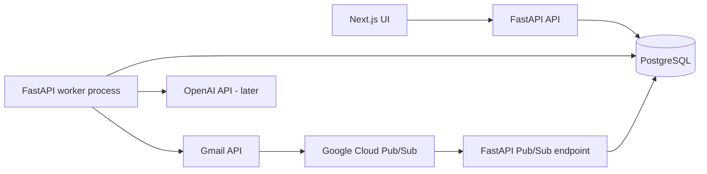
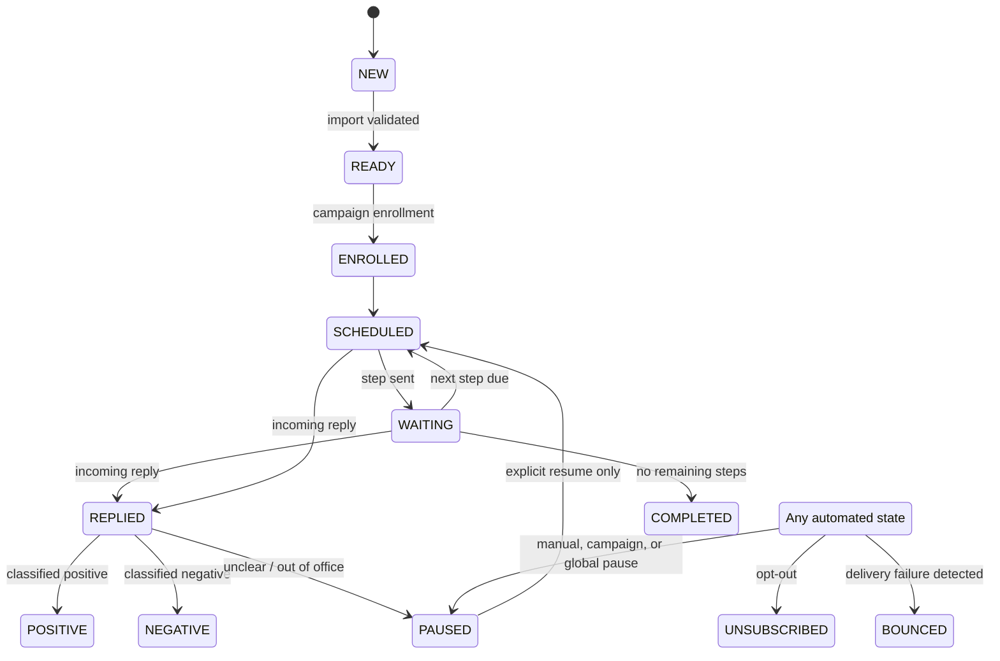

# Architecture

## Scope and decisions

V1 is a private application for one operator and one Gmail account. The system will preserve a `user_id` boundary in its schema so it can grow later, but it will not implement teams, roles, subscriptions, tenant administration, or billing.

The backend owns all Gmail credentials, business rules, scheduling, and state transitions. The browser never receives Gmail refresh tokens and never sends Gmail messages directly.



## Components

### Frontend

Next.js with TypeScript provides the operational UI: dashboard, contacts, campaign editor, sequence editor, activity, analytics, and settings. It talks only to versioned FastAPI endpoints. Pages must render server-safe data and use a strict Content Security Policy. Business rules remain in the backend.

### Backend API

FastAPI exposes authenticated application APIs and the narrow unauthenticated-but-verified Pub/Sub endpoint. It contains presentation schemas, application services, and dependency wiring. Endpoint handlers do not call Gmail directly; they call use cases which depend on provider interfaces.

### Domain and application layer

The domain layer owns state transitions, template validation, enrollment eligibility, scheduling calculations, opt-out rules, and rate-limit decisions. The application layer orchestrates commands such as `enroll_contact`, `pause_campaign`, `send_scheduled_step`, and `process_gmail_history`.

### Infrastructure layer

PostgreSQL repositories, the Gmail provider, Google OAuth client, encrypted-token vault, OpenAI provider (later), and clock/randomness adapters live here. The first interfaces are intentionally small:

```text
EmailProvider: send, get_profile, watch, stop_watch, list_history, get_message
AIProvider: classify_reply, generate_personalization        # implemented later
Clock: now
```

### PostgreSQL and worker

PostgreSQL is both the system of record and the reliable job queue. A separate worker process claims due jobs with row locking, executes one bounded operation, and writes the resulting state. This avoids Redis and Celery in V1 while remaining safe across restarts and multiple worker processes.

The worker also runs lightweight maintenance work: watch renewal, fallback Gmail synchronization, expired-lease recovery, scheduled-send dispatch, and analytics rollups if needed.

## Repository structure after scaffolding

```text
apps/
  web/                         # Next.js UI
  api/
    app/
      api/                     # FastAPI routes and request/response models
      application/             # use cases and transactions
      domain/                  # states, policies, templates, interfaces
      infrastructure/          # SQLAlchemy, Gmail, OAuth, encryption
      worker/                  # job dispatcher and handlers
    migrations/                # Alembic migrations
    tests/
      unit/
      integration/
      e2e/
docs/                          # optional future relocation for long-form docs
docker-compose.yml             # local services, added with scaffolding
```

The initial documentation remains at the repository root for discoverability. When application code exists, it may be moved into `docs/` without changing its content.

## Gmail design

### OAuth and account connection

The application uses Google’s server-side authorization-code flow with exact registered redirect URIs, a one-time signed `state` value, PKCE, and offline access. The callback exchanges the code on the backend, obtains the Gmail profile, encrypts the refresh token, and persists the Gmail account identity plus granted scopes. Access tokens remain short-lived in process memory.

The initial scope set should be kept as small as the implemented feature allows:

- `openid`, `email`, `profile` for the operator session
- `https://www.googleapis.com/auth/gmail.send` to send
- `https://www.googleapis.com/auth/gmail.readonly` to detect and read relevant replies

Google’s web-server flow supports offline access through a refresh token, which is required for scheduled work while the operator is not present. [Google OAuth guidance](https://developers.google.com/identity/protocols/oauth2/web-server)

### Sending and threading

Every outbound message is created as RFC-compliant MIME plain text, encoded as base64url, then submitted with `users.messages.send`. The successful response supplies Gmail’s message and thread IDs; both are persisted with the outbound message.

The first step creates the thread. Later sequence steps use the stored Gmail `threadId`, the exact original subject, and RFC-compliant `In-Reply-To` and `References` headers. Gmail requires all three properties to include a message in an existing thread. [Gmail threading requirements](https://developers.google.com/workspace/gmail/api/guides/threads) and [sending guide](https://developers.google.com/workspace/gmail/api/guides/sending)

### Reply detection

On connection, the backend calls `users.watch` for the Gmail account’s `INBOX` label and stores the resulting `historyId` and expiration. Gmail publishes inbox changes to a Cloud Pub/Sub topic; the endpoint persists an idempotent notification record and creates a `process_gmail_history` job. The worker uses `history.list` from the last stored cursor, retrieves relevant messages, and advances the cursor only after processing.

For each incoming message, the worker checks that it is not sent by the connected Gmail account and that its Gmail thread matches a known enrollment. It then verifies the sender against the enrolled contact address before creating an inbound message/reply record. A recognized reply pauses the enrollment and cancels every pending send job for it in the same transaction.

Gmail notifications are not the source of truth: they can be delayed or dropped, so a low-frequency fallback sync reconciles history for connected accounts. Gmail requires watches to be renewed at least every seven days and recommends daily renewal. [Gmail push notification guidance](https://developers.google.com/workspace/gmail/api/guides/push)

### Notification verification and recovery

The Pub/Sub endpoint verifies the configured subscription and validates the push authentication token/audience before accepting the payload. The Pub/Sub message ID is unique in the database. The decoded payload only identifies an email address and history ID; it is never trusted as a reply on its own.

If Gmail reports that the saved history cursor is too old, the worker records the failure, performs a bounded inbox resynchronization for the account, reconciles known campaign threads, replaces the cursor, and raises an activity event. It does not silently lose the gap.

## Scheduler and delivery safety

### Job lifecycle

```text
PENDING -> CLAIMED -> RUNNING -> COMPLETED
                    |          
                    +-> RETRY_SCHEDULED -> CLAIMED
                    +-> NEEDS_REVIEW
                    +-> CANCELLED
```

1. A campaign enrollment creates one `send_step` job for its next eligible step.
2. At or after `run_at`, a worker atomically claims it with `FOR UPDATE SKIP LOCKED` and a lease.
3. The worker rechecks global, campaign, contact, and enrollment eligibility inside a transaction.
4. It reserves an outbox message with a stable idempotency key and generated RFC `Message-ID`.
5. It asks Gmail to submit the prepared message, then records Gmail IDs and success atomically with job completion.
6. On success, it schedules the next step using the persisted `sent_at` plus the configured delay, adjusted to working hours and permitted jitter.

Only a `PENDING` job is claimable. A stale `CLAIMED` lease is recoverable, but an outbound message reservation prevents a second worker from sending the same step.

### Ambiguous Gmail submissions

An external email API cannot offer true distributed exactly-once delivery to a database transaction. The conservative V1 policy is therefore:

- confirmed pre-submission/transient failures are retried with exponential backoff;
- a timeout or connection loss after submission becomes `SUBMISSION_UNKNOWN`;
- the worker searches/reconciles the known message marker and Gmail thread before any further decision;
- if certainty cannot be established, the job becomes `NEEDS_REVIEW` and all automated re-sends stop.

This trades a small amount of manual review for a hard operational principle: the engine must not make a second blind send after an unknown outcome.

### Limits, pauses, and retries

Before reserving an outbox message, the worker locks account and campaign rate-window rows, confirms daily/hourly/per-campaign allowances, and checks the global emergency pause. If a limit or working-hours rule prevents sending, the job is rescheduled to the next eligible time; it is not marked failed.

Retries are capped and classified. Authentication failures disconnect the account and pause affected campaigns. Repeated provider failures trip a configurable campaign failure threshold and pause the campaign. Every branch emits an activity event with correlation ID and a safe error summary.

## Explicit state machines

Contact lifecycle state and campaign-enrollment execution state are separate because a contact can outlive a campaign. `UNSUBSCRIBED` is a contact-level terminal override; an enrollment state never permits a send when the contact is unsubscribed.



The exact enrollment states are `ENROLLED`, `SCHEDULED`, `SENDING`, `WAITING`, `REPLIED`, `PAUSED`, `UNSUBSCRIBED`, `BOUNCED`, `COMPLETED`, `ERROR`, and `MANUALLY_STOPPED`. Campaign states are `DRAFT`, `ACTIVE`, `PAUSED`, and `ARCHIVED`.

## Reply classification

V1 immediately pauses for every recognized human reply, including an out-of-office response. Deterministic rules identify explicit opt-outs and obvious out-of-office responses; all other new replies begin as `UNCLEAR` until the operator classifies them. A later AI worker can create a suggested classification (`positive`, `negative`, `neutral`, `unsubscribe`, `out_of_office`, or `unclear`) without changing the paused state or overwriting a human decision.

## Deployment

Local development will run web, API, worker, and PostgreSQL with Docker Compose. Production should start with a single low-cost managed project: one web service, one API service, one worker service, and managed PostgreSQL. Google Cloud hosts the Pub/Sub topic and push subscription required by Gmail. Each service has separate environment variables and least-privilege credentials.

V1 has no uptime claim beyond the hosting provider. Database backups, migration-before-deploy, health endpoints, structured logs, and an alert on worker heartbeat failure are required before live outreach.

## Implementation roadmap

- [x] Phase 0 — repository discovery and architecture package
- [ ] Phase 1 — scaffold Next.js/FastAPI/PostgreSQL, migrations, test harness, auth session, health checks
- [ ] Phase 2 — Google OAuth, encrypted Gmail account storage, connection health, disconnect/reconnect
- [ ] Phase 3 — contacts, CSV validation/deduplication, imports, list/detail UI
- [ ] Phase 4 — campaigns, sequence steps, safe templates, enrollment, state transitions
- [ ] Phase 5 — PostgreSQL scheduler, controls, controlled-address Gmail send, activity timeline
- [ ] Phase 6 — Gmail watch/History reply detection, automatic stop, resync and failure paths
- [ ] Phase 7 — dashboard, activity filters, basic campaign analytics
- [ ] Phase 8 — asynchronous AI personalization and suggested reply classification with human review
- [ ] Phase 9 — deployment, backups, operational runbook, controlled live test

## Assumptions

1. V1 has a single trusted operator and one connected Gmail account.
2. The operator will register a Google Cloud project, OAuth consent screen, and Pub/Sub topic.
3. Contacts represent legitimate B2B outreach targets and the operator is responsible for applicable consent, privacy, and anti-spam obligations.
4. Sending begins with a controlled test recipient and conservative configurable limits, not a production list.
5. Plain-text content only is sufficient for V1.
6. Gmail’s Gmail API and Cloud Pub/Sub are available to the connected account/project.
7. PostgreSQL is available for local development and production; no Redis is required in V1.
8. The application is accessed over HTTPS in production.
9. AI is not required for the first usable milestone.
10. A manual review queue is acceptable for uncertain external-send outcomes.

## Principal risks

| Risk | Mitigation |
| --- | --- |
| OAuth verification, scope, or consent-screen friction | Start with the single operator/test users; request only required scopes and document the Google setup. |
| Duplicate email after timeout | Stable outbox identity, Gmail reconciliation, and `NEEDS_REVIEW` instead of blind retry. |
| Missed/delayed reply notification | Daily watch renewal, idempotent History API processing, and fallback synchronization. |
| Wrong thread/contact association | Match Gmail thread and sender against enrollment; log but do not act on ambiguous messages. |
| Sending after a reply or opt-out | One transactional pause/cancel operation; recheck eligibility immediately before send. |
| Gmail quotas/deliverability problems | Conservative defaults, limits, working hours, jitter, failure circuit breaker, and clear operator controls. |
| Token compromise | Envelope encryption, no browser token access, secret rotation, redacted logs, and disconnect/revoke flow. |
| CSV quality or duplicates | Staged imports, validation results, normalized email uniqueness, and an explicit duplicate report. |
| Scheduler crash or duplicate workers | Row locks, leases, idempotency keys, retry classifications, worker heartbeat. |
| Overbuilding before proving the core flow | Vertical-slice roadmap; AI, bulk operations, and SaaS features are explicitly deferred. |
