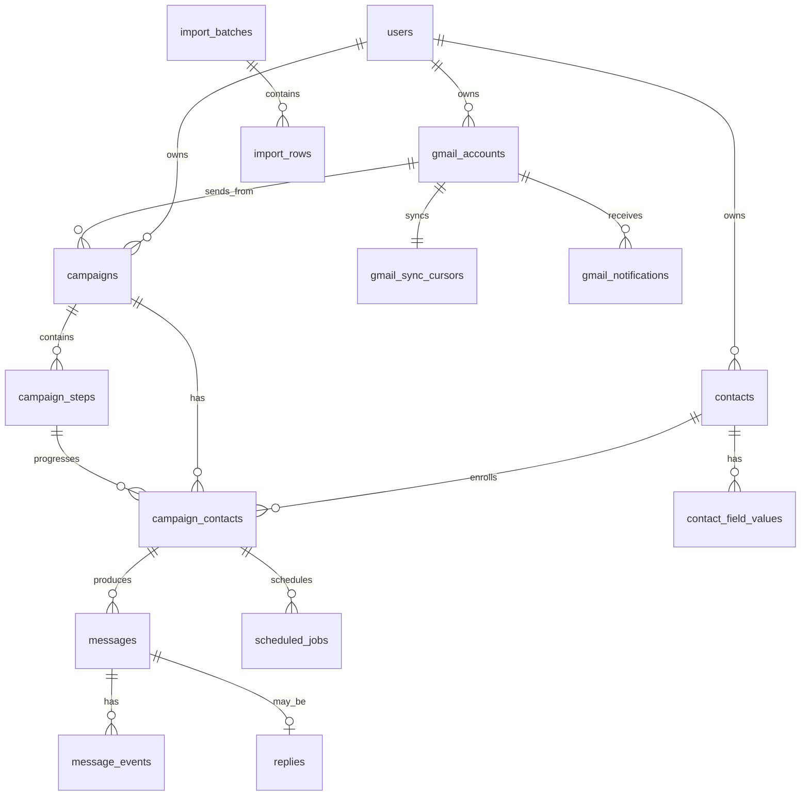

# Database design

## Conventions

- PostgreSQL 16+; primary keys are UUIDs generated server-side.
- Every table has `created_at timestamptz not null` and `updated_at timestamptz not null` unless it is immutable event data, in which case it has `occurred_at`.
- Email columns use `citext` and are normalized/validated before persistence.
- Lifecycle values use constrained text/check constraints rather than scattered booleans. Migrations will define reusable PostgreSQL enum types only where change frequency is low.
- Timestamps are stored in UTC. Display time zones and working hours live in settings.
- IDs from Gmail are external identifiers, never primary keys.

## Relationship map

## Identity and settings

### `users`

One row in V1, retained for a future migration path.

| Column | Notes |
| --- | --- |
| `id uuid pk` | Internal owner identifier |
| `email citext not null unique` | Google identity email |
| `google_subject text unique` | Stable OpenID Connect `sub` claim |
| `display_name text` | Operator display name |
| `status text check` | `ACTIVE` or `DISABLED` |
| timestamps | Audit |

### `settings`

One row per user: `user_id unique fk users`, `global_sending_enabled boolean not null default false`, daily/hourly defaults, working-hours JSON, time zone, randomized-delay range, sender signature, retry defaults, and `updated_by`. The emergency stop is `global_sending_enabled = false`; it defaults to off after a fresh deployment.

### `gmail_accounts`

| Column | Notes |
| --- | --- |
| `id uuid pk` | Gmail connection |
| `user_id uuid fk users` | Owner |
| `google_email citext not null unique` | Gmail profile email |
| `google_subject text unique` | Immutable Google account identity when available |
| `encrypted_refresh_token bytea not null` | AES-GCM ciphertext only |
| `token_key_version smallint not null` | Supports rotation |
| `granted_scopes text[] not null` | Connection verification |
| `status text check` | `CONNECTED`, `REAUTH_REQUIRED`, `DISCONNECTED`, `ERROR` |
| `last_verified_at`, `disconnected_at` | Connection audit |
| timestamps | Audit |

Constraints/indexes: `unique(user_id)` in V1, `unique(google_email)`, index `(user_id, status)`. Access tokens are not persisted unless a later provider library makes this necessary; refresh tokens are sufficient.

## Contacts and imports

### `contacts`

`id`, `user_id fk`, `email citext`, `first_name`, `last_name`, `company`, `website`, `city`, `industry`, `source`, `lifecycle_state`, `opted_out_at`, `bounce_detected_at`, `notes`, timestamps.

`lifecycle_state` is one of `NEW`, `READY`, `ENROLLED`, `SCHEDULED`, `CONTACTED`, `FOLLOW_UP_PENDING`, `REPLIED`, `POSITIVE`, `NEGATIVE`, `UNSUBSCRIBED`, `BOUNCED`, `PAUSED`, `COMPLETED`, `ERROR`. It represents the latest operational condition, not a substitute for enrollment state.

Constraints/indexes:

- `unique(user_id, email)` prevents duplicate contacts across imports.
- index `(user_id, lifecycle_state, updated_at desc)` powers attention lists.
- check: `opted_out_at is not null` when state is `UNSUBSCRIBED`.

### `tags` and `contact_tags`

`tags`: `id`, `user_id`, normalized `name`, timestamps, `unique(user_id, name)`.

`contact_tags`: `contact_id fk`, `tag_id fk`, `created_at`, primary key `(contact_id, tag_id)`.

### `custom_field_definitions` and `contact_field_values`

Definitions hold `id`, `user_id`, `name`, normalized `key`, `value_type`, timestamps, and `unique(user_id, key)`. Values hold `contact_id`, `field_id`, typed `value_jsonb`, timestamps, and `unique(contact_id, field_id)`. A JSONB value permits future types while the definition validates it.

### `import_batches` and `import_rows`

`import_batches`: owner, original filename, SHA-256 file digest, status (`UPLOADED`, `VALIDATED`, `COMMITTED`, `FAILED`), total/imported/skipped/invalid/duplicate counts, timestamps.

`import_rows`: batch, row number, raw row JSONB, normalized email, outcome (`IMPORTED`, `SKIPPED`, `INVALID`, `DUPLICATE`), error code/message, optional `contact_id`, `unique(batch_id, row_number)`.

This preserves a visible import report and avoids silently discarding CSV data.

## Campaigns and execution

### `campaigns`

`id`, `user_id fk`, `gmail_account_id fk`, `name`, `description`, `status`, `daily_limit`, `hourly_limit`, `working_hours_override jsonb nullable`, `failure_threshold`, `paused_at`, `archived_at`, timestamps.

`status`: `DRAFT`, `ACTIVE`, `PAUSED`, `ARCHIVED`. Index `(user_id, status, updated_at desc)` and index `(gmail_account_id, status)`.

### `campaign_steps`

`id`, `campaign_id fk`, `step_number`, `delay_after_previous_seconds integer >= 0`, `subject_template text not null`, `body_template text not null`, `is_active`, timestamps.

Constraints: `unique(campaign_id, step_number)`, `check(length(trim(subject_template)) > 0)`, `check(length(trim(body_template)) > 0)`. Step 1 must have zero delay; the application service enforces consecutive numbering and valid templates before a campaign can activate.

### `campaign_contacts`

This is the sequence execution aggregate.

| Column | Notes |
| --- | --- |
| `id uuid pk` | Enrollment identity |
| `campaign_id`, `contact_id` | Required FKs |
| `execution_state` | Explicit current execution state |
| `current_step_id` | Last successfully sent step; nullable initially |
| `next_step_id` | Next intended step; nullable when terminal |
| `next_action_at timestamptz` | Persisted scheduling target |
| `gmail_thread_id text` | Set after first successful send |
| `paused_reason text` | `REPLY`, `GLOBAL`, `CAMPAIGN`, `CONTACT`, `MANUAL`, etc. |
| `stopped_at`, `completed_at` | Terminal audit |
| `version integer not null default 1` | Optimistic aggregate version |
| timestamps | Audit |

Constraints/indexes:

- `unique(campaign_id, contact_id)`.
- partial unique active enrollment by `(contact_id, gmail_account_id)` for execution states that can send, preventing two concurrent automated campaigns emailing the same contact from the same mailbox.
- index `(execution_state, next_action_at)` for schedule creation/reconciliation.
- index `(gmail_thread_id)` where not null for reply lookup.

## Messages, replies, events

### `messages`

An immutable email record and outbound outbox reservation.

`id`, `gmail_account_id fk`, `campaign_contact_id fk nullable`, `campaign_step_id fk nullable`, `contact_id fk nullable`, `direction` (`OUTBOUND`/`INBOUND`), `submission_state` (`PREPARED`, `SUBMITTED`, `SUBMISSION_UNKNOWN`, `FAILED`, `RECEIVED`), `idempotency_key uuid`, `rfc_message_id text`, Gmail `gmail_message_id`, `gmail_thread_id`, `gmail_internal_date`, `from_email`, `to_emails citext[]`, `subject`, `body_text`, `sent_at`, `received_at`, `provider_payload jsonb` with sensitive fields excluded, timestamps.

Constraints/indexes:

- `unique(idempotency_key)` for outbound reservations.
- `unique(gmail_account_id, gmail_message_id)` where Gmail message ID is present.
- `unique(gmail_account_id, rfc_message_id)` for outbound messages.
- index `(campaign_contact_id, sent_at)`.
- index `(gmail_account_id, gmail_thread_id, direction)`.

### `replies`

`id`, `message_id fk unique`, `campaign_contact_id fk`, `contact_id fk`, `classification`, `classification_source` (`RULE`, `AI`, `HUMAN`), `classification_confidence numeric nullable`, `classification_reason text nullable`, `classified_at`, `classified_by_user_id nullable`, timestamps.

Classification values: `POSITIVE`, `NEGATIVE`, `NEUTRAL`, `UNSUBSCRIBE`, `OUT_OF_OFFICE`, `UNCLEAR`. Index `(classification, created_at desc)` supports an attention queue.

### `message_events` and `activity_events`

Both are append-only. `message_events` records provider-specific milestones against a message. `activity_events` records operator-facing events such as `CONTACT_IMPORTED`, `JOB_CLAIMED`, `EMAIL_SENT`, `EMAIL_SEND_FAILED`, `REPLY_DETECTED`, `SEQUENCE_PAUSED`, `CAMPAIGN_PAUSED`, `GLOBAL_PAUSE_ENABLED`.

Columns include `id`, owner/account/campaign/contact/enrollment foreign keys as relevant, `event_type`, `correlation_id uuid`, safe `metadata jsonb`, `occurred_at`. Unique `(event_type, idempotency_key)` where an upstream event supplies a key. Index `(campaign_id, occurred_at desc)` and `(contact_id, occurred_at desc)`.

## Scheduling, quotas, and Gmail sync

### `scheduled_jobs`

`id`, `job_type`, `idempotency_key`, owner/account/campaign/enrollment/step foreign keys as relevant, `run_at`, `status`, `attempt_count`, `max_attempts`, `locked_by`, `locked_until`, `last_error_code`, `last_error_safe_detail`, `payload jsonb`, `completed_at`, timestamps.

`status`: `PENDING`, `CLAIMED`, `RUNNING`, `RETRY_SCHEDULED`, `COMPLETED`, `CANCELLED`, `NEEDS_REVIEW`, `FAILED`.

Indexes/constraints:

- `unique(idempotency_key)`.
- partial index on `(run_at, created_at)` for `status in ('PENDING', 'RETRY_SCHEDULED')`.
- partial unique `(campaign_contact_id, campaign_step_id, job_type)` for live send jobs, where job type is `SEND_STEP` and status is claimable/in-progress.
- index `(locked_until)` for recovery.

The worker claims through `SELECT ... FOR UPDATE SKIP LOCKED`, then sets a finite lease. A lease does not by itself authorize another send if an outbound message reservation already exists.

### `send_rate_counters`

`id`, `scope_type` (`ACCOUNT`/`CAMPAIGN`), `scope_id`, `window_type` (`HOUR`/`DAY`), `window_start`, `sent_count`, timestamps; `unique(scope_type, scope_id, window_type, window_start)`. The worker locks this row during send reservation so simultaneous workers cannot exceed a limit.

### `gmail_sync_cursors`

`gmail_account_id pk fk`, `last_history_id text`, `watch_expiration_at`, `last_synced_at`, `last_fallback_sync_at`, `sync_state`, `last_error_safe_detail`, timestamps. It represents the durable Gmail History API cursor.

### `gmail_notifications`

`id`, `gmail_account_id fk`, `pubsub_message_id text unique`, `notification_history_id text`, `published_at`, `received_at`, `status`, `safe_payload jsonb`, timestamps. The endpoint writes this before acknowledging Pub/Sub, so duplicate delivery is harmless.

## Invariants enforced by every send path

1. The global setting must be enabled.
2. Gmail account and campaign must be active.
3. Contact and enrollment must not be unsubscribed, replied, paused, bounced, stopped, or completed.
4. The claimed job must match the enrollment’s next step and current aggregate version.
5. A confirmed outbound message may exist only once per enrollment/step/idempotency key.
6. A recognized reply or opt-out cancels all pending/retry send jobs for that enrollment transactionally.
7. Ambiguous provider submission results never trigger a blind automatic resend.

## Migration and retention policy

Alembic owns every schema change. Migrations must be reversible where safe and tested against a disposable PostgreSQL database in CI. Email content and contact PII have a documented retention setting; deleting a contact will be a deliberate future workflow that preserves minimal audit metadata where legally appropriate. Backups are encrypted and access-controlled.
